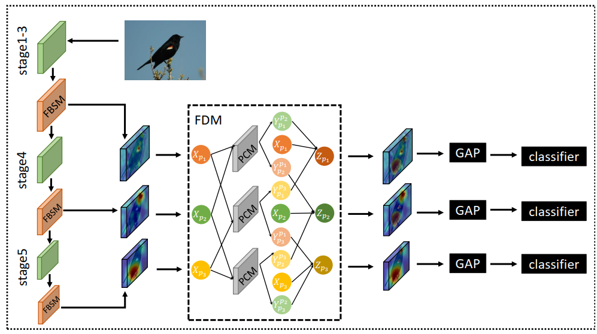

#  Feature Boosting, Suppression, and Diversification for Fine-Grained Visual Classification

PyTorch Code for [Feature Boosting, Suppression, and Diversification for Fine-Grained Visual Classification](https://arxiv.org/abs/2103.02782v1)



# Requirement

python 3.6.5

PyTorch >= 1.2.0

torchvision >= 0.4.0

# Training

change ``root_dir`` in the ``config.py`` and run ``python3 train.py``
(You can change other hyper-parameters in the ``config.py``)

# Citation

Please cite our paper if it is helpful for your research.
```
@misc{song2021feature,
      title={Feature Boosting, Suppression, and Diversification for Fine-Grained Visual Classification}, 
      author={Jianwei Song and Ruoyu Yang},
      year={2021},
      eprint={2103.02782},
      archivePrefix={arXiv},
      primaryClass={cs.CV}
}

```

# Contact
Thanks for your attention!
If you have any suggestion or question, you can open an issue or contact songjianwei@smail.nju.edu.cn
